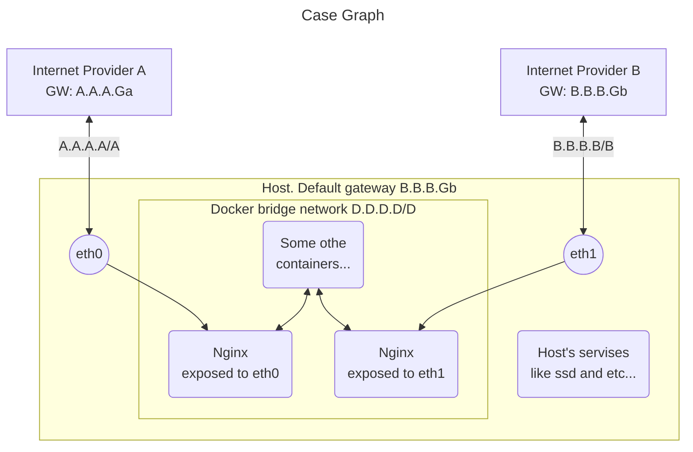

# Multihomed Docker Host Routing

```mermaid

---
title: Case Graph
---

graph

    ISPA[Internet Provider A
    GW: A.A.A.Ga] <--A.A.A.A/A--> eth0
    eth0 --> NgA
    
    subgraph "Host. Default gateway B.B.B.Gb"
        eth0((eth0)) 
        S(Host's servises 
        like ssd and etc...)
        subgraph Docker bridge network D.D.D.D/D
            NgA(Nginx 
            exposed to eth0)
            DC(Some othe
            containers...) <-->
            NgB(Nginx 
            exposed to eth1)
            DC <--> NgA
            
        end

        eth1((eth1))
  
    end
    ISPB[Internet Provider B
    GW: B.B.B.Gb] <--B.B.B.B/B--> eth1
    eth1 --> NgB
 

```
