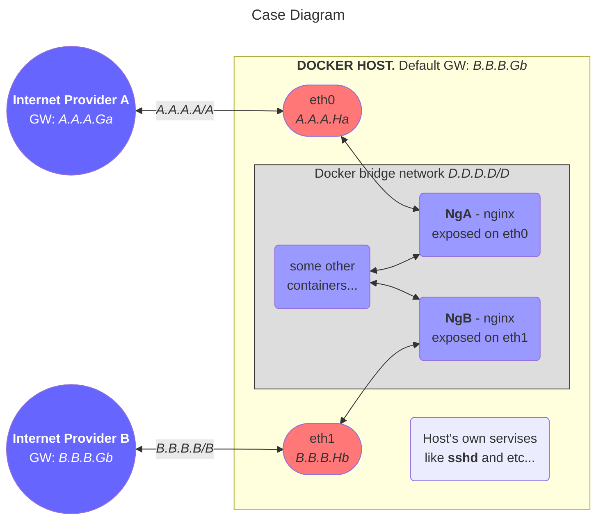

# Multihomed Docker Host Routing


The Diagram on the top demonstrates some case then the Docker Host should be connected to different ISPs. 

Without some tunning all outgoing traffic will be routed through the default gateway **B.B.B.Gb**. Even if the request comes through **eth0** and is served by **NgA** (or Host's own services), the response will leave the **Host** through **eth1**. The only exception is when the response destination IP belongs the same subnetwork which the **eth0** is connected (i.e. belongs *A.A.A.A/A*). It's because the **Host's** routing table looks like this:
```
default via B.B.B.Gb/B dev eth1 proto static
A.A.A.A/A dev eth0 proto kernel scope link src A.A.A.Ha
B.B.B.B/B dev eth1 proto kernel scope link src B.B.B.Hb
```
