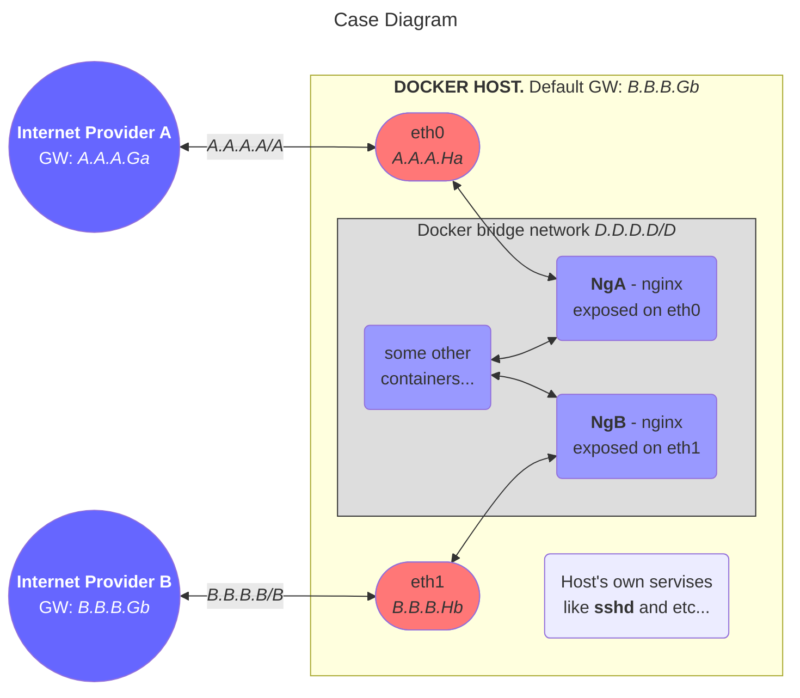

# Multihomed Docker Host Routing


The Diagram above demonstrates some case then the Docker Host should be connected to different ISPs.

Without some tunning all outgoing traffic will be routed through the default gateway **B.B.B.Gb**. Even if the request comes through **eth0** and is served by **NGa** (or the Host's own services), the response will leave the Host through **eth1** with **B.B.B.Hb** as the source address. The only exception is when the response's destination IP belongs to the same subnetwork as the **eth0** is connected (i.e. belongs to **A.A.A.A/A**). It's because the Host's routing table looks like this:
```
default via B.B.B.Gb/B dev eth1 proto static
A.A.A.A/A dev eth0 proto kernel scope link src A.A.A.Ha
B.B.B.B/B dev eth1 proto kernel scope link src B.B.B.Hb
```

The goal is to force to use a different gateway (ie **A. A. A. Ga**) for all responses to traffic arrived through **eth0**. We'll use routing policy and Netfilter's markup rules. 
Here is the content of the **netplan** yml-file for both interfaces with comments:

```
network:
  ethernets:
    eth0:
      addresses:
      - A.A.A.Ha/A
      routes:
# This is declaration of different routing table **100* with default gateway A.A.A.Ga
      - to: default
        via: A.A.A.Ga
        table: 100
      nameservers:
        addresses:
        - A.A.A.Da # The ISP specified DNS server
        - 8.8.8.8
      routing-policy:
# Table 100 should be used to route any packets with Netfiler's mark 100.
      - from: 0.0.0.0/0
        mark: 100
        table: 100
# Any packets with A.A.A.Ha as a source (ie Host's own responses) should be routed through the table 10
      - from: A.A.A.Ha/32
        table: 100
    eth1:
      addresses:
      - B.B.B.Hb/b
      nameservers:
        addresses:
        - B.B.B.Db
        - 8.8.8.8
      routes:
      - to: default
        via: B.B.B.Gb
  version: 2

```

! editin is in progress
